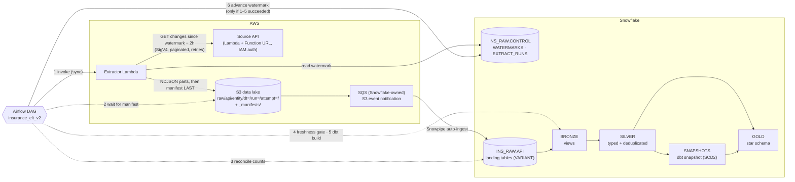
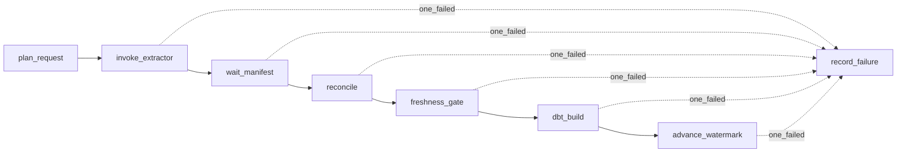

A daily, watermark-driven ELT pipeline. An API is pulled incrementally into S3, auto-loaded into
Snowflake by Snowpipe, and modelled by dbt into a bronze / silver / gold medallion with a star schema.
Airflow (Amazon MWAA) orchestrates it and owns the only step that may advance the watermark.

## End-to-end flow



## Components

| Component | Technology | Job | Key decision |
|---|---|---|---|
| Source API | Lambda + Function URL (`AWS_IAM` auth) | Serves the change feed: every record version with `updated_at` in `(since, until]`, sorted, paginated | Mock of a real CDC-style API; deterministic, so reruns return identical data |
| Extractor | Lambda (Python 3.12) | Reads the watermark, pulls the window, writes gzip NDJSON + `_manifest.json` | Stateless; never moves the watermark |
| Data lake | S3 | Immutable landing zone, partitioned by business date, run and attempt | Files are never overwritten (Snowpipe never reloads a file name) |
| Loader | Snowpipe (auto-ingest via SQS) | Loads each file into a VARIANT landing table within about a minute | Schema-on-read: new source fields never break the load |
| Control | Snowflake `WATERMARKS`, `EXTRACT_RUNS` | Pipeline state and run audit | State lives in the warehouse, not in Airflow Variables |
| Transform | dbt Core (own venv on the MWAA workers) | Bronze → silver → snapshot → gold, tests, contracts | One selector per pipeline: `source:policy_admin_api+ dim_date` |
| Orchestrator | Amazon MWAA, Airflow 3.3 | Runs the steps in order; the only writer of the watermark | `max_active_runs=1`, `catchup=False` (the watermark catches up gaps) |
| Infrastructure | AWS CDK (Python), GitHub Actions + OIDC | Deploys stacks, DAGs, dbt project | No long-lived AWS keys anywhere |

## The DAG, step by step



<Steps>
  <Step title="plan_request">
    Freezes the request (`run_id`, `business_date`, `window_end`) in XCom, so every retry asks for the same window.
  </Step>
  <Step title="invoke_extractor — LambdaInvokeFunctionOperator, synchronous">
    The Lambda finished. `read_timeout` (330 s) is longer than the Lambda timeout (300 s) and SDK retries are off,
    so a slow run is never re-invoked in parallel.
  </Step>
  <Step title="wait_manifest — sensor, reschedule mode">
    The manifest exists, so every data file of the run is in S3. S3, not the Lambda response, is the source of truth.
  </Step>
  <Step title="reconcile — sensor, reschedule mode">
    Rows Snowpipe loaded **from exactly this manifest's files** equal the manifest row counts. Fewer: wait. More: fail.
  </Step>
  <Step title="freshness_gate — dbt source freshness">
    The source is still producing (newest `updated_at` younger than 48 h). Catches a silent upstream stall that would reconcile as 0 = 0.
  </Step>
  <Step title="dbt_build">
    All v2 models, the snapshot and 52 tests. A failed test stops everything downstream.
  </Step>
  <Step title="advance_watermark">
    Moves each watermark to the max `updated_at` **loaded in Snowflake**, in one transaction, never backwards.
  </Step>
</Steps>

<Note>
  `record_failure` (`trigger_rule="one_failed"`) marks the run `FAILED` in `EXTRACT_RUNS` and leaves the watermark
  untouched. It is a task, not a DAG callback: in Airflow 3 DAG callbacks run in the DAG processor, which has no dbt venv.
</Note>

## Reliability guarantees

| Failure | What happens | Why it's safe |
|---|---|---|
| Any task fails | Watermark stays; the next run pulls the same window again | At-least-once delivery; silver deduplicates |
| Lambda retried | New `attempt=<ts>/` folder, manifest rewritten | Files are immutable; reconcile counts only the manifest's attempt |
| Lambda slower than the HTTP timeout | Cannot happen: client timeout > Lambda timeout | No duplicate concurrent extracts |
| Snowpipe slow | `reconcile` returns "not yet" and pokes again | Sensor, not a one-shot check |
| Same version sent twice (buffer) | Kept twice in bronze, once in silver | MERGE on `(business key, updated_at)` |
| Pipeline down for days | One run pulls the whole gap | Window starts at the watermark, not at "yesterday" |
| Source stops sending data | `freshness_gate` fails after 48 h | Freshness on the source's own timestamp, not load time |

## Security

| Identity | Auth | Can do |
|---|---|---|
| Extractor Lambda → Snowflake | Workload Identity Federation (IAM role ↔ `INS_LAMBDA_SVC`) | `SELECT` on `WATERMARKS` only |
| Extractor Lambda → S3 | IAM role | `PutObject` on `raw/api/*` only |
| Extractor Lambda → source API | SigV4 (IAM) | Invoke the Function URL only |
| MWAA → Snowflake | Workload Identity Federation (`INS_MWAA_SVC`) | `INS_LOADER` (landing + control), `INS_TRANSFORMER` (dbt) |
| Snowflake → S3 | Storage integration (IAM role + external ID) | Read `raw/*` |
| GitHub Actions → AWS | OIDC role | Deploy |

<Check>No passwords, API keys or access keys are stored anywhere.</Check>

## Infrastructure (CDK stacks)

| Stack | Contents |
|---|---|
| `Elt-Storage` | Data lake + MWAA buckets, Snowflake read role, S3 → Snowpipe notification |
| `Elt-Network` | VPC for MWAA (2 AZs, 1 NAT) |
| `Elt-Ingest` | Source API Lambda + Function URL, extractor Lambda (Linux wheels bundled at synth, no Docker) |
| `Elt-Mwaa` | MWAA environment, execution role (may invoke the extractor), DAG + config sync |

Snowflake objects are created by the numbered scripts in `snowflake/` (01–05).

## Repository layout

```text
dags/
  insurance_elt_v2.py        the DAG
  insurance/                 generator (source data), control.py (reconcile / advance / fail), config
  dbt/                       dbt project: models/{bronze,silver,gold}, snapshots/, tests/
lambdas/
  source_api/                mock policy-admin API
  extractor/                 watermark extractor
infra/                       CDK app + stacks
snowflake/                   01–05 setup scripts (roles, stages, control, landing, pipes)
docs/                        this documentation (Mintlify)
```
