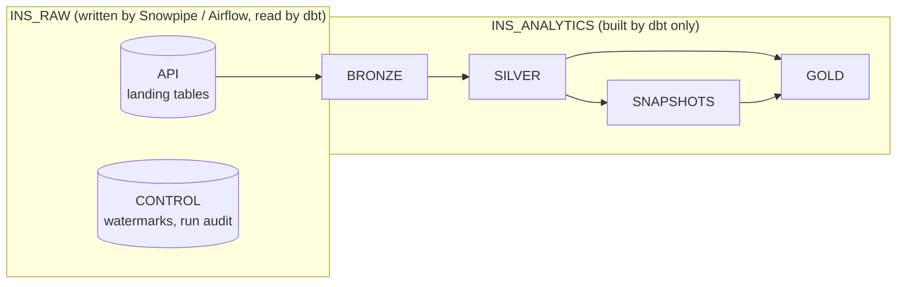
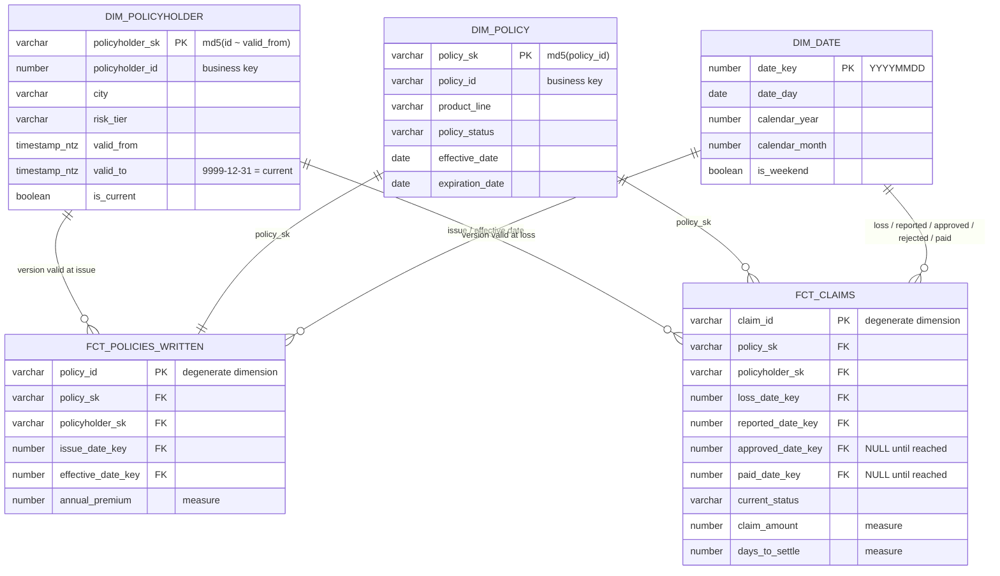

## Databases and schemas



- **Raw and analytics are separate databases.** Loaders write only to `INS_RAW`; dbt reads it and writes
  only to `INS_ANALYTICS`; analysts read only `INS_ANALYTICS`. A bad dbt run cannot damage raw data.
- Prod schemas have clean names (`BRONZE`, `SILVER`, `GOLD`); each developer builds into
  `DEV_<NAME>_BRONZE` and so on (custom `generate_schema_name` macro).

## Model inventory

| Layer | Model | Materialization | Grain | Key |
|---|---|---|---|---|
| Bronze | `brz_api__policyholders` / `__policies` / `__claims` | view | one row per delivery (duplicates kept) | — |
| Silver | `slv_policyholder_versions` | incremental merge | policyholder version | `(policyholder_id, updated_at)` |
| Silver | `slv_policyholders` | view | policyholder (current) | `policyholder_id` |
| Silver | `slv_policies` | incremental merge | policy | `policy_id` |
| Silver | `slv_claim_events` | incremental merge | claim status change | `(claim_id, updated_at)` |
| Snapshot | `snap_api_policyholders` | dbt snapshot | policyholder version (since first run) | `dbt_scd_id` |
| Gold | `dim_date` | table (full refresh) | day | `date_key` |
| Gold | `dim_policyholder` | table (full refresh), **SCD2** | policyholder version | `policyholder_sk` |
| Gold | `dim_policyholder_snap` | table (full refresh), **SCD2** | policyholder version | `policyholder_sk` |
| Gold | `dim_policy` | table (full refresh), **SCD1** | policy | `policy_sk` |
| Gold | `fct_policies_written` | table (full refresh) | policy issued | `policy_id` |
| Gold | `fct_claims` | **incremental merge** | claim | `claim_id` |

<Info>
  The three load patterns, one clear example each: **incremental** `fct_claims` (and silver),
  **full refresh** the dimensions and `fct_policies_written`, **snapshot SCD2** `snap_api_policyholders`.
</Info>

## Star schema



`dim_policyholder_snap` has the same columns as `dim_policyholder`; the facts point to `dim_policyholder`
(the snapshot version is kept to compare the two SCD2 approaches).

## The facts

| Fact | Type | Grain | Load | Measures |
|---|---|---|---|---|
| `fct_policies_written` | Transaction | one row per policy issued | full refresh | `annual_premium` |
| `fct_claims` | Accumulating snapshot | one row per claim, **updated** as it moves OPEN → APPROVED/REJECTED → PAID | incremental merge on `claim_id` | `claim_amount`, `days_to_settle` |

`fct_claims` pivots the claim's status events into one milestone date per stage. Each run finds the claims
that received a new event and rebuilds them from **all** of their events, so earlier milestones are never
overwritten with NULLs.

## How tables connect

**Dimensions don't join each other — every dimension joins to the facts.** The fact row records the
relationship at the moment of the event (who bought which policy, and when).

```sql
select d.calendar_month, ph.city, p.product_line, sum(f.annual_premium) as premium
from fct_policies_written f
join dim_policy       p  on f.policy_sk       = p.policy_sk
join dim_policyholder ph on f.policyholder_sk = ph.policyholder_sk   -- city AT THE TIME OF SALE
join dim_date         d  on f.issue_date_key  = d.date_key
group by 1, 2, 3;
```

### Surrogate keys

| Dimension | Key | Generation | Why |
|---|---|---|---|
| `dim_date` | `date_key` | `to_number(to_char(date, 'YYYYMMDD'))` | Readable; facts compute it without a lookup |
| `dim_policyholder` | `policyholder_sk` | `md5(policyholder_id ~ valid_from)` | One key **per version** (the business key repeats in SCD2) |
| `dim_policyholder_snap` | `policyholder_sk` | `dbt_scd_id` (generated by the snapshot) | Same idea, generated by dbt |
| `dim_policy` | `policy_sk` | `md5(policy_id)` | Independent of the source; stays stable if the dim becomes SCD2 |

<Tip>
  Hash keys, not sequences: the dimensions are rebuilt every run, and a hash gives every row the same key on
  every rebuild, so facts never point to a stale key.
</Tip>

### Point-in-time lookup (SCD2)

When a fact is built, it stores the key of the customer **version valid at the event time**:

```sql
left join dim_policyholder ph
       on ph.policyholder_id = p.policyholder_id
      and c.loss_date::timestamp_ntz >= ph.valid_from     -- [valid_from, valid_to)
      and c.loss_date::timestamp_ntz <  ph.valid_to
```

Windows never overlap (tested), so exactly one version matches and no fact row is duplicated.

### Unknown member and role-playing dates

- Every dimension has a `-1` "Unknown" row. Facts use `coalesce(sk, '-1')` with a `left join`, so a missing
  dimension row never drops a fact row and totals stay correct.
- `dim_date` plays several roles: `fct_claims` joins it as loss, reported, approved, rejected and paid date.
  Milestone keys are NULL until the milestone is reached.

### Linking a policy to its current owner directly

Not needed for analysis (go through the fact), but for lookups the durable business key works:

```sql
select s.policy_id, ph.city as current_city
from silver.slv_policies s
join gold.dim_policyholder ph
  on ph.policyholder_id = s.policyholder_id
 and ph.is_current;                         -- SCD2: pick the current version
```

## Quality gates

| Where | Check |
|---|---|
| Source | Freshness on the source's own `updated_at` (warn 26 h, error 48 h) |
| Silver | Grain (`unique` / `unique_combination`), `not_null` keys (a wrong VARIANT path returns NULL silently), accepted values, claim → policy relationship |
| Gold | **Enforced contracts** on every model (names and types checked before build; `not_null` enforced by Snowflake), `unique` keys, every fact key exists in its dimension |
| SCD2 | `scd2_contiguous_windows` (no gap or overlap), `scd2_one_current` (exactly one current row) — both dimensions |
| Business | Premium in gold = silver (no fan-out, nothing dropped); claim milestones in time order; *warn*: claims paid without approval |

<Warning>
  Local build of the whole v2 selection: **55 nodes, 54 pass, 1 warn**. The warning is a real source-data issue —
  23 claims paid without an approval — reported on every run without blocking the pipeline.
</Warning>

## Verified numbers (dev build, 2026-09-30)

| | Rows |
|---|---|
| Bronze policyholders (3 loads) | 374 |
| → silver versions | 187 (100 customers) |
| → `dim_policyholder` | 188 (187 + unknown) |
| → `dim_policyholder_snap` | 101 (100 + unknown) |
| Silver policies → `fct_policies_written` | 175 → 175 (premium 230,297.22 = 230,297.22) |
| Silver claim events → `fct_claims` | 204 events → 113 claims |
