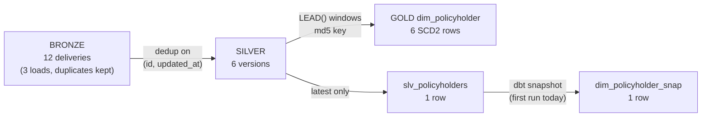

History of a changing entity (policyholders: city, risk tier) is preserved at every layer by one
rule per layer. No layer ever overwrites a *version*; the SCD Type 2 columns at the top are
**calculated**, not stored.

## Bottom to top

| # | Layer | Rule that keeps history | Mechanism |
|---|---|---|---|
| 1 | Source API | Sends every **version**, each with its `updated_at` | Change feed `(updated_since, until]` |
| 2 | Watermark | Never skips a version (may repeat one) | Window = `(watermark − 2 h, run time]`; the watermark moves only after the whole run succeeded |
| 3 | S3 | Files are never overwritten | Each attempt writes `run=<id>/attempt=<ts>/part-NNNNN.json.gz` |
| 4 | Landing / bronze | Nothing is updated or deleted | Snowpipe `COPY INTO` = insert only; duplicates kept |
| 5 | Silver version log | A change is always an **insert** | `MERGE` key = `(policyholder_id, updated_at)` |
| 6 | Gold SCD2 dim | Validity windows derived on every run | `LEAD(updated_at)`, stable `md5` key, full refresh |

### 1–2. Source and watermark

```text
GET /?entity=policyholders&updated_since=<watermark − 2h>&until=<run time>
```

- The API returns every version changed in the window — two changes of one customer are two rows.
- `WATERMARKS.HIGH_WATERMARK` is the max `updated_at` **actually loaded in Snowflake** for the run. It is
  written by the last DAG task only, with `GREATEST(old, new)`, so it can never move backwards.
- The 2 h lookback re-pulls recent versions (late commits in the source). A failed run leaves the
  watermark in place, so the next run re-pulls the same window.

<Info>Result: **at-least-once** delivery — a version can arrive twice, never zero times.</Info>

### 3–4. Immutable files, append-only bronze

- Snowpipe keeps 14 days of load history per pipe and **never reloads a file name**, even with new content.
  A retried extract therefore writes a new `attempt=` folder instead of overwriting.
- Landing tables (`INS_RAW.API.*`) only receive inserts. Every delivery of every version stays, with
  `RUN_ID`, `SOURCE_FILE`, `FILE_ROW` and `LOADED_AT`.
- Bronze is the permanent raw history: every layer above can be rebuilt from it.

### 5. Silver — the version log

`slv_policyholder_versions` (incremental):

```sql
-- 1) within the batch: one copy per version (latest delivery wins)
qualify row_number() over (partition by policyholder_id, updated_at
                           order by loaded_at desc, source_file desc) = 1

-- 2) against the table: the VERSION is the key
merge into slv_policyholder_versions t using (batch) s
   on t.policyholder_id = s.policyholder_id
  and t.updated_at      = s.updated_at
when matched     then update ...   -- same version re-delivered: same values, no change
when not matched then insert ...   -- a change has a NEW updated_at: always a new row
```

- A change can never match an older row, so old versions are never touched. There is no delete.
- The incremental filter reads only bronze rows loaded after `max(loaded_at) − 3 h`; re-reading is
  harmless because the merge is idempotent.

<Tip>
  If the key were `policyholder_id` alone, the same MERGE would be **SCD Type 1** (overwrite). Whether an
  upsert keeps history depends only on the key. `slv_policies` deliberately uses `policy_id` alone —
  policies don't change after issue.
</Tip>

### 6. Gold — derived SCD Type 2

`dim_policyholder` (full refresh from the version log):

```sql
md5(policyholder_id || '~' || to_char(updated_at, 'YYYY-MM-DD HH24:MI:SS'))  as policyholder_sk,
updated_at                                                                     as valid_from,
coalesce(lead(updated_at) over (partition by policyholder_id order by updated_at),
         '9999-12-31'::timestamp_ntz)                                          as valid_to,
valid_to = '9999-12-31'                                                        as is_current
```

- Windows are `[valid_from, valid_to)` and chain with no gap or overlap (tested).
- The md5 key is deterministic: a rebuild gives every existing version the same key, so facts stay valid.
- A late version with an older `updated_at` slots into place on the next rebuild.

## Worked example — customer 100



| valid_from | valid_to | city | risk | policyholder_sk |
|---|---|---|---|---|
| 2026-09-01 00:00 | 2026-09-08 09:00 | Chennai | LOW | `0c9f505a…` |
| 2026-09-08 09:00 | 2026-09-14 09:00 | Bengaluru | LOW | `375f997d…` |
| 2026-09-14 09:00 | 2026-09-24 09:00 | Pune | LOW | `ed63c809…` |
| 2026-09-24 09:00 | 2026-09-29 09:00 | Pune | HIGH | `6ab737ca…` |
| 2026-09-29 09:00 | 2026-09-30 09:00 | Pune | MEDIUM | `668b226c…` |
| 2026-09-30 09:00 | 9999-12-31 | Pune | LOW | `b548f6f2…` (current) |

The 2026-09-29 version arrived three times (smoke test, first scheduled run, and again through the
2 h buffer of the first incremental run) and exists once in silver.

## Two ways to build SCD2

<Tabs>
  <Tab title="Version log → dim_policyholder">
    Built from `slv_policyholder_versions`, which keeps **every** version the source sent.

    - Changes are inserts (the key includes `updated_at`); nothing is overwritten.
    - `valid_from` / `valid_to` / `is_current` are calculated with `LEAD()` on every full-refresh rebuild.
    - Rebuildable at any time from bronze.
  </Tab>
  <Tab title="dbt snapshot → dim_policyholder_snap">
    Built from `snap_api_policyholders`, a dbt snapshot (timestamp strategy on `updated_at`) of
    `slv_policyholders` (current state only). On each run:

    - newer `updated_at` → close the old row (`dbt_valid_to` = new `updated_at`) and insert the new row
    - new customer → insert; unchanged → nothing

    The history exists **only** inside the snapshot table; dbt never full-refreshes snapshots.
  </Tab>
</Tabs>

## Comparison

| | Version log → `dim_policyholder` | dbt snapshot → `dim_policyholder_snap` |
|---|---|---|
| Where history lives | Bronze (raw) + silver version log | The snapshot table only |
| How a change is kept | Insert (key includes `updated_at`) | Update old row + insert new row |
| How `valid_to` is set | Calculated with `LEAD()` on every rebuild | Written once, when the next change is seen |
| Rebuildable | Yes, from bronze | No |
| Several changes between two runs | All kept | Only the last one |
| Late / out-of-order versions | Slot in correctly | Ignored |
| History starts | At the first version the source sent | At the first snapshot run |
| Needs from the source | A change feed with `updated_at` | Only the current state |
| Customer 100 today | 6 rows | 1 row |

<Note>
  **When to use which:** with a change feed (CDC, event log, versioned API), build SCD2 from the version log.
  Use a dbt snapshot when the source only exposes current state (an OLTP table, a full daily dump) and there
  is no other way to observe changes.
</Note>
