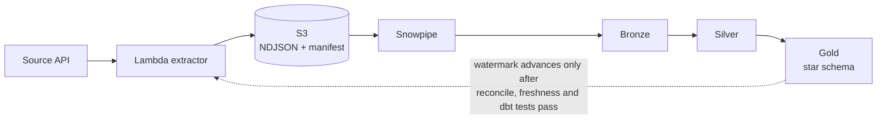

An insurance policy-admin API is pulled incrementally by a Lambda, landed in S3, auto-loaded by
Snowpipe, and modelled by dbt into a bronze / silver / gold star schema. Airflow on Amazon MWAA
orchestrates every run and owns the only step that may advance the watermark.

<CardGroup cols={3}>
  <Card title="Architecture" icon="sitemap" href="/architecture">
    Components, the Airflow DAG step by step, reliability guarantees and security.
  </Card>
  <Card title="History capture" icon="clock-rotate-left" href="/history-capture">
    From the API change feed to SCD Type 2 — version log vs dbt snapshot.
  </Card>
  <Card title="Data model" icon="diagram-project" href="/data-model">
    Schemas, star schema, surrogate keys, point-in-time joins and quality gates.
  </Card>
</CardGroup>

## Stack

| Layer | Technology |
|---|---|
| Orchestration | Amazon MWAA (Airflow 3.3) |
| Ingestion | AWS Lambda (source API + extractor), S3, Snowpipe auto-ingest |
| Warehouse | Snowflake, Workload Identity Federation (no passwords or keys) |
| Transformation | dbt Core: incremental models, snapshot, enforced contracts, tests |
| Infrastructure | AWS CDK (Python), GitHub Actions with OIDC |

## Highlights

<AccordionGroup>
  <Accordion title="Idempotent end to end" icon="rotate">
    The watermark moves only after the data passed every check. Any failure re-pulls the same window
    on the next run, files are never overwritten, and silver deduplicates re-deliveries.
  </Accordion>
  <Accordion title="No secrets anywhere" icon="key">
    Lambda and MWAA sign in to Snowflake with Workload Identity Federation; the extractor calls the
    source API with SigV4; GitHub deploys to AWS with OIDC.
  </Accordion>
  <Accordion title="Three dbt load patterns" icon="layer-group">
    Incremental merge (`fct_claims`, silver), full refresh (dimensions) and snapshot SCD2
    (`snap_api_policyholders`), plus SCD2 built from a version log, compared side by side.
  </Accordion>
  <Accordion title="Quality gates" icon="shield-check">
    Source-to-target reconciliation per run, source freshness, enforced contracts on every gold model,
    SCD2 window tests, and a gold-equals-silver premium reconciliation.
  </Accordion>
</AccordionGroup>
